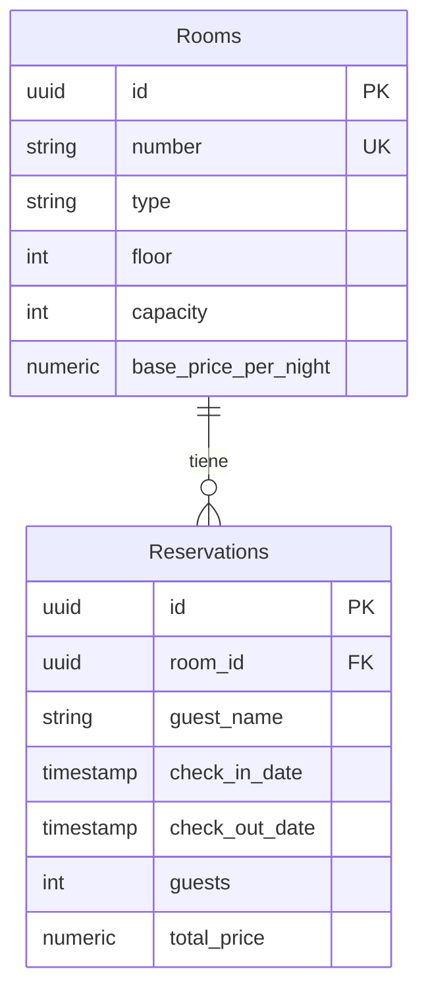

# Investigación 1 — Backend (Autenticación + RBAC)

Backend en **.NET 10 (minimal APIs)** con arquitectura **Vertical Slice** y separación **Command/Query (CQRS)**. Persistencia con **EF Core + PostgreSQL**.

## Estructura

```
Features/
├── Auth/                  # Persona 1 — autenticación
│   ├── Login, Register, AdminRegister, Refresh, Logout
├── Users/                 # Persona 2 — RBAC y reglas de negocio
│   ├── GetMe                    (Query)   GET /users/me
│   ├── GetUsers                 (Query)   GET /users
│   ├── GetUserById              (Query)   GET /users/{id}
│   ├── UpdateUserStatus         (Command) PATCH /users/{id}/status
│   └── UpdateSubscriptionExpiration (Command) PATCH /users/{id}/subscription-expiration
└── Reservations & Rooms/  # Persona 3 — dominio propio (Hotel)
    ├── CreateReservation        (Command) POST /reservations
    ├── GetReservations          (Query)   GET /reservations
    ├── CreateRoom               (Command) POST /rooms
    └── GetRooms                 (Query)   GET /rooms
```

## Autenticación (Persona 1)

| Método | Ruta              | Acceso          | Descripción                          |
| ------ | ----------------- | --------------- | ----------------------------------- |
| POST   | `/register`       | Público         | Registra un `Subscription_L1`.      |
| POST   | `/login`          | Público         | Emite accessToken + refreshToken.   |
| POST   | `/admin/register` | 1er Admin o Auth | Crea un `Admin`.                    |
| POST   | `/refresh`        | Refresh token   | Rota refresh y emite nuevo access.  |
| POST   | `/logout`         | Autenticado     | Revoca las sesiones refresh.        |

Roles válidos: `Admin` y `Subscription_L1`. No existe endpoint para cambiar el rol de un usuario.

## Endpoints de usuarios — RBAC (Persona 2)

| Método | Ruta                                 | Acceso                        | Regla de negocio aplicada                                         |
| ------ | ------------------------------------ | ----------------------------- | ----------------------------------------------------------------- |
| GET    | `/users/me`                          | Cualquier usuario autenticado | Devuelve los datos del usuario del token.                         |
| GET    | `/users`                             | Solo `Admin`                  | Lista todos los usuarios.                                         |
| GET    | `/users/{id}`                        | Solo `Admin`                  | Consulta un usuario por id; `404 User not found` si no existe.    |
| PATCH  | `/users/{id}/status`                 | Solo `Admin`                  | Activa/desactiva un usuario. Véanse reglas especiales abajo.      |
| PATCH  | `/users/{id}/subscription-expiration`| Solo `Admin`                  | Extiende/modifica la expiración de una suscripción `Subscription_L1`. |

## Reglas de negocio

- Endpoint protegido sin token válido → **401 Unauthorized**.
- Token válido pero rol insuficiente → **403 Forbidden**.
- `Subscription_L1` con `SubscriptionExpirationDate` vencida → **403** en cualquier endpoint autenticado (middleware global, no endpoint por endpoint).
- Un Admin **no puede desactivarse a sí mismo** (`PATCH /users/{id}/status` con su propio id → **403**).
- Un Admin **no puede desactivar al último Admin activo** del sistema (**403**).
- La ruta de activar/desactivar es **independiente** de la ruta de expiración de suscripción.
- No existe endpoint para cambiar el rol de un usuario.

## Dominio propio — Hotel (Persona 3)

Dominio de negocio del equipo: **reservas de hotel**. Dos entidades relacionadas, distintas al módulo de autenticación:

- **Rooms** (habitación): `Number` (único), `Type` (Single/Double/Suite), `Floor`, `Capacity`, `BasePricePerNight`.
- **Reservations** (reserva): `RoomId` (FK → Rooms), `GuestName`, `CheckInDate`, `CheckOutDate`, `Guests`, `TotalPrice`.

**Relación elegida (1:N)**: *una habitación tiene muchas reservas; cada reserva pertenece a una habitación*. Tiene sentido para el problema porque una habitación opera con períodos disjuntos de ocupación, y cada reserva siempre referencia exactamente un cuarto. Permite demostrar la relación en lecturas (reserva → datos del cuarto) y es coherente con el módulo de suscripciones (un `Subscription_L1` reserva; el `Admin` administra).

### Diagrama de entidades

```
Rooms (1) ────────────────< Reservations (N)
id            (PK)          id             (PK)
number        (UNIQUE)      room_id        (FK → Rooms.id)
type                       guest_name
floor                      check_in_date
capacity                   check_out_date
base_price_per_night       guests
                            total_price
```



Ahora bien, las tablas de autenticación en resumen: `Users` y `RefreshSessions` se relacionan 1:N (un usuario posee varias sesiones de refresh), con índices únicos en `Email` y `TokenHash`.

### Endpoints del dominio (CQRS)

| Método | Ruta              | Acceso         | Operación                  | Reglas de negocio                                                                                              |
| ------ | ----------------- | -------------- | -------------------------- | ------------------------------------------------------------------------------------------------------------- |
| POST   | `/reservations`   | Autenticado    | **Command** `CreateReservation` | `CheckOut > CheckIn` (400) · `1 ≤ Guests ≤ capacidad` (400) · sin superposición con el mismo cuarto (409) · `TotalPrice = noches × BasePricePerNight` |
| GET    | `/reservations`   | Solo `Admin`   | **Query** `GetReservations`    | Lectura relacionada: cada reserva incluye los datos de su habitación (`Include(Room)`)                          |
| POST   | `/rooms`          | Solo `Admin`   | **Command** `CreateRoom`       | `Number` único (400) · `BasePricePerNight > 0` (400)                                                            |
| GET    | `/rooms`          | Autenticado    | **Query** `GetRooms`           | Lista habitaciones (flujo del frontend: elegir cuarto y reservar)                                               |

### Migraciones y Supabase

- Migración **`Initial`** versionada en `Migrations/` (una sola migración que crea auth + dominio).
- Aplicada con `dotnet ef database update` contra el proyecto Supabase del equipo.
- La conexión va por **user-secrets** (`ConnectionStrings:DefaultConnection`), nunca versionada.
- Se usa el **session pooler** de Supabase (`aws-0-<región>.pooler.supabase.com:5432`, usuario `postgres.<ref>`): el transaction pooler (6543) no soporta migraciones de EF Core.

## Formato de error

Todos los errores usan un `ErrorResponse` consistente: `{ "error": "<mensaje>" }`.

## Configuración

Copiar `appsettings.Example.json` a `appsettings.json` (o usar variables de entorno) y definir `Jwt:Secret` (mínimo 32 caracteres). La conexión a la base va por user-secrets (no se versiona):

```bash
dotnet user-secrets set "ConnectionStrings:DefaultConnection" "Host=aws-0-<region>.pooler.supabase.com;Port=5432;Database=postgres;Username=postgres.<ref>;Password=<password>;SslMode=Require;Trust Server Certificate=true"
```

Correr la API:

```bash
dotnet run
```

Reconstruir la base desde las migraciones del repo:

```bash
dotnet ef database update
```