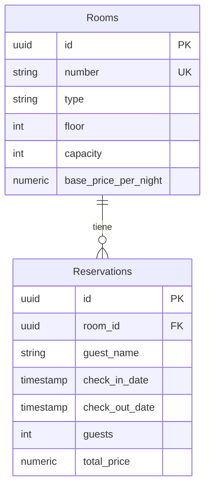

# Investigación 1 — Autenticación, RBAC y dominio Hotel

Backend **.NET 10 (minimal APIs)** + frontend **React/Vite**. Arquitectura **Vertical Slice** con **CQRS** (Command/Query). Persistencia **EF Core + PostgreSQL (Supabase)**.

## Arquitectura (patrón del equipo)

Se eligió **Vertical Slice** como base común:

- Cada caso de uso vive en su carpeta (`Features/<Area>/<UseCase>/`) con Endpoint + Handler + Request/Command/Query.
- Escrituras = **Commands**; lecturas = **Queries**.
- Código transversal en `Shared/` (Domain, Auth, Infrastructure, Contracts).

```
Features/
├── Auth/           # Persona 1 — login, register, refresh, logout
├── Users/          # Persona 2 — RBAC y reglas de negocio
├── Rooms/          # Persona 3 — dominio propio
└── Reservations/   # Persona 3 — dominio propio
frontend/           # Persona 4 — UI + integración + demo
```

---

## Persona 1 — Autenticación y sesiones

| Método | Ruta | Acceso | Descripción |
| ------ | ---- | ------ | ----------- |
| POST | `/register` | Público | Registra un `Subscription_L1`. |
| POST | `/login` | Público | Emite `accessToken` (~1h) + `refreshToken` (~14 días). |
| POST | `/admin/register` | 1er Admin o Auth | Crea un `Admin`. |
| POST | `/refresh` | Refresh token | Rota refresh y emite nuevo access. |
| POST | `/logout` | Autenticado | Revoca sesiones refresh del usuario. |

- Contraseñas hasheadas; política: mín. 6 caracteres, letra + número.
- Credenciales inválidas o `IsActive=false` → **401**.
- Tras logout, el refresh anterior deja de funcionar.

Roles: `Admin` y `Subscription_L1`. No hay endpoint para cambiar el rol.

---

## Persona 2 — RBAC + reglas de negocio

| Método | Ruta | Acceso | Regla |
| ------ | ---- | ------ | ----- |
| GET | `/users/me` | Autenticado | Perfil del token. |
| GET | `/users` | Admin | Lista usuarios. |
| GET | `/users/{id}` | Admin | Usuario por id (`404` si no existe). |
| PATCH | `/users/{id}/status` | Admin | Activar/desactivar. |
| PATCH | `/users/{id}/subscription-expiration` | Admin | Actualizar expiración de `Subscription_L1`. |

Reglas:

- Sin token válido → **401**. Token válido, rol insuficiente → **403**.
- `Subscription_L1` con suscripción vencida → **403** (middleware global).
- Un Admin **no** puede desactivarse a sí mismo ni al **último Admin activo**.
- Rutas de status y expiración son independientes.

---

## Persona 3 — Dominio Hotel + Supabase

Entidades propias (1:N): **Rooms** ← **Reservations**.

```
Rooms (1) ────────────────< Reservations (N)
id, number (UK), type,      id, room_id (FK), guest_name,
floor, capacity,            check_in/out, guests, total_price
base_price_per_night
```



Auth: `Users` 1:N `RefreshSessions` (índices únicos en `Email` y `TokenHash`).

| Método | Ruta | Acceso | CQRS | Notas |
| ------ | ---- | ------ | ---- | ----- |
| POST | `/rooms` | Admin | Command | Número único; precio > 0. |
| GET | `/rooms` | Autenticado | Query | Listado para reservar. |
| POST | `/reservations` | Autenticado | Command | Fechas válidas, capacidad, sin solape (409), precio calculado. |
| GET | `/reservations` | Admin | Query | Incluye datos de la habitación. |

Migración `Initial` en `Migrations/` (auth + dominio). Aplicar:

```bash
dotnet ef database update
```

Usar el **session pooler** de Supabase (`:5432`, usuario `postgres.<ref>`). El transaction pooler (`:6543`) no sirve para migraciones EF.

---

## Persona 4 — Frontend + integración

App en `frontend/` (Vite + React + TypeScript):

- Login con manejo de `accessToken` / `refreshToken` en `localStorage`.
- **Refresh automático**: ante 401 en una petición autenticada se llama a `POST /refresh` (una sola vez) y se reintenta.
- Vista protegida `GET /users/me` con menú según rol (Admin ve Reservas / Admin cuartos; `Subscription_L1` no).
- Dominio: listar habitaciones, crear reserva; Admin crea cuartos y lista reservas.
- Errores visibles para **401 / 403 / credenciales inválidas**.

### Cómo correr

**Backend**

1. Copiar `.env.example` → `.env` y definir `POSTGRES_PASSWORD` y `JWT_SECRET` (≥ 32 chars).
2. Connection string en `appsettings.Development.json` con placeholder `[YOUR-PASSWORD]`.
3. `dotnet ef database update` (si hace falta).
4. `dotnet run` → API en `http://localhost:5018`.
5. Si no hay Admin, se siembra `admin@example.com` / `AdminPass1`.

**Frontend**

```bash
cd frontend
cp .env.example .env   # VITE_API_BASE_URL=http://localhost:5018
npm install
npm run dev            # http://localhost:5173
```

CORS del backend permite `5173`–`5175`.

Formato de error de la API: `{ "error": "<mensaje>" }`.

---

## Guion de demo (10 minutos)

| Min | Qué mostrar | Quién / endpoint |
| --- | ----------- | ---------------- |
| 0:00–1:00 | Estructura Vertical Slice + diagrama Rooms↔Reservations | README / carpeta `Features/` |
| 1:00–2:30 | Login Admin (`admin@example.com`). Mostrar tokens en Network. Fallar login (mal password → 401). | Persona 1 + 4 |
| 2:30–4:00 | Perfil `GET /users/me`. Menú Admin visible. Mencionar access ~1h / refresh ~14d y logout que revoca. | Persona 1 + 4 |
| 4:00–5:30 | Admin crea habitación (`POST /rooms`). Listar (`GET /rooms`). Crear reserva. | Persona 3 + 4 |
| 5:30–7:00 | `GET /reservations` (lectura relacionada). Intentar desactivar el propio Admin o el último Admin → 403. | Persona 2 + 3 |
| 7:00–8:30 | Registrar / login como `Subscription_L1`. Menú sin Admin. Forzar `/reservations` → bloqueo 403 en UI. | Persona 2 + 4 |
| 8:30–9:30 | Suscripción vencida → 403 global. Refresh automático (expirar access o forzar 401 y ver `POST /refresh`). | Persona 1 + 2 |
| 9:30–10:00 | Supabase: migración `Initial`, connection pooler, `.env` / secrets. Cierre. | Persona 3 |

Checklist rápido en vivo:

1. Login OK / login inválido (401).
2. Crear room + reservation.
3. Rol insuficiente (403).
4. Logout → refresh viejo falla.
